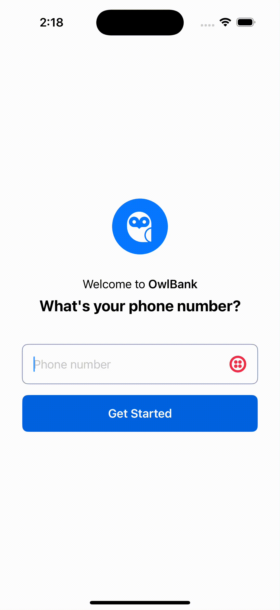

# Twilio Verify Passkeys Android & iOS SDKs (KMP)

## Table of Contents

* [About](#about)
* [Documentation](#documentation)
* [Requirements](#requirements)
* [Quickstart](#quickstart)
* [Building and Running Sample App](#building-and-running-sample-app)
* [Project Structure](#project-structure)
* [Code Structure](#code-structure)
* [Troubleshooting](#troubleshooting)

## About <a name="about"></a>

Twilio Passkeys SDK enables developers to easily add Passkeys into their existing authentication flows within their own mobile applications. The Verify Passkeys SDK supports passkeys creation and authentication using the FIDO/WebAuthn industry standard.

## Documentation <a name="documentation"></a>

[Verify Passkeys Overview](https://www.twilio.com/docs/verify/passkeys)
[WebAuthn](https://www.w3.org/TR/webauthn-2/)

## Requirements <a name="requirements"></a>

- [Android Studio](https://developer.android.com/studio) for Android development. Minimum version Hedgehog
- [Xcode](https://developer.apple.com/xcode/) for iOS development. 16.x
- [IntelliJ IDEA](https://www.jetbrains.com/idea/) or [Android Studio](https://developer.android.com/studio) for shared code development.
- Android 9 (API Level 28) or higher
- iOS 16 or higher
- Gradle 8.2
- Java 17

## Quickstart <a name="quickstart"></a>

### Initialize the SDK
#### Android
1. Add the implementation app build gradle:
  ```
    implementation("com.twilio:twilio-verify-passkeys-android:$sdkVersionName")
  ```
2. Sync the project.
3. Use the SDK by creating an instance of TwilioPasskey:
  ```
    val twilioPasskey = TwilioPasskey(context)
  ```

#### iOS
1. In Xcode project go to File > Add Packages
2. Enter the repository URL 
  ```
    https://github.com/twilio/twilio-verify-passkeys-ios
  ```
3. Select the version you'd like to use (preferably the latest release)
4. Click Add Package to finish integrating the SDK
5. Import TwilioPasskeys in the files you will make use of it:
```
let twilioPasskey = TwilioPasskey()
```

#### KMP
1. Add the implementation statement in dependencies:
  ```
    implementation("com.twilio:twilio-verify-passkeys-common:$sdkVersionName")
  ```
2. Sync the project.
3. To use the passkeys SDK in KMP there are separate initialization for iOS and Android as the SDK needs the Android context to work:
   - iOS
     ```
       val twilioPasskey = TwilioPasskey()
     ```
   - Android
     ```
        val twilioPasskey = TwilioPasskey(context)
      ```

### Create registration

Use the `TwilioPasskey` instance to create a registration by calling the `create(String, AppContext)` function.

The first param is a `String` representation of a create passkey request, check how to [create passkey payload](#create-passkey-payload) (`createPayload`).

The second param is an instance of a `com.twilio.passkeys.AppContext`, it is created by passing the current `Activity` instance in Android or the `UIWindow` instance in iOS.

You can also call the `create(CreatePasskeyRequest, AppContext)` function, where `CreatePasskeyRequest` is a wrapper object of a [create passkey payload](#create-passkey-payload) schema.

**Android**
```
val createPasskeyResult = twilioPasskey.create(createPasskeyRequest, AppContext(activity))
when(createPasskeyResult) {
  is CreatePasskeyResult.Success -> {
    // verify the createPasskeyResult.createPasskeyResponse against your backend and finish sign up
  }
  
  is  CreatePasskeyResult.Error -> {
    // handle error
  }
}
```

**iOS**

```
let response = try await twilioPasskey.create(createPasskeyRequest: createPasskeyRequest, appContext: AppContext(uiWindow: window))
if let success = response as? CreatePasskeyResult.Success {
  // verify the createPasskeyResult.createPasskeyResponse against your backend and finish sign up
} else if let error = response as? CreatePasskeyResult.Error {
  // handle error
}
```

### Authenticate a user

Use the `TwilioPasskey` instance to authenticate a user by calling the `authenticate(String, AppContext)` function.

The first param is a `String` representation of an authentication request, it follows the schema of an [authenticate passkey payload](#authenticate-passkey-payload) (`authenticatePayload`).

The second param is an instance of a `com.twilio.passkeys.AppContext`, it is created by passing the current `Activity` instance in Android or the `UIWindow` instance in iOS.

You can also call the `authenticate(AuthenticatePasskeyRequest, AppContext)` function, which the `AuthenticatePasskeyRequest` is a wrapper object of an [authenticate passkey payload](#authenticate-passkey-payload).

**Android**

```
val authenticatePasskeyResult = twilioPasskey.authenticate(authenticatePasskeyRequest, AppContext(activity))
when(authenticatePasskeyResult) {
  is AuthenticatePasskeyResult.Success -> {
    // verify the authenticatePasskeyResult.authenticatePasskeyResponse against your backend
  }
  
  is AuthenticatePasskeyResult.Error -> {
    // handle error 
  }
}
```

**iOS**

```
let response = try await twilioPasskey.authenticate(authenticatePasskeyRequest: authenticatePasskeyRequest, appContext: AppContext(uiWindow: window))
if let success = response as? AuthenticatePasskeyResult.Success {
  // verify the authenticatePasskeyResult.authenticatePasskeyResponse against your backend and finish sign in.
} else if let error = response as? AuthenticatePasskeyResult.Error {
  // handle error
}
```

### Create Passkey Payload <a name="create-passkey-payload"></a>

The creation payload for creating a passkey is a String obtained by requesting your backend a challenge for registering a user, it uses the JSON schema:
```
{
  "rp": {
    "id": "your_backend",
    "name": "PasskeySample"
  },
  "user": {
    "id": "WUV...5Ng",
    "name": "1234567890",
    "displayName": "1234567890"
  },
  "challenge": "WUY...jZQ",
  "pubKeyCredParams": [
    {
      "type": "public-key",
      "alg": -7
    }
  ],
  "timeout": 600000,
  "excludeCredentials": [],
  "authenticatorSelection": {
    "authenticatorAttachment": "platform",
    "residentKey": "preferred",
    "userVerification": "preferred"
  }
}
```

1. **rp** (Relying Party - Server Details)
  - **id**
    - The domain where the passkey will be used (e.g., `example.com`).
    - Must match the domain where the authentication will happen.

  - **name**
    - A human-readable name for the service (shown to the user during registration).

2. **user** (User Information)
  - **id**
    - A Base64 URL-encoded unique user ID (usually a server-generated random value).
    - Used to identify the user uniquely in the system.

  - **name**
    - A username or account identifier.
    - Could be an email, phone number, or user ID.

  - **displayName**
    - A user-friendly name displayed during registration.
    - Typically the same as `name`, but could be more descriptive.

3. **challenge** (Server-Generated Random Value)
  - A Base64 URL-encoded random value generated by the server.
  - Prevents replay attacks by ensuring each request is unique.
  - The client (browser/device) signs this challenge when authenticating.

4. **pubKeyCredParams** (Public Key Parameters)
  - **type**
    - Indicates the credential being created is a public-private key pair.
    - Always `"public-key"` for WebAuthn and passkeys to work.

  - **alg**
    - Represents `ES256` (Elliptic Curve Digital Signature Algorithm - ECDSA using SHA-256).
    - Other possible values include `-257` for RSA.

5. **timeout**
  - Specifies how long the user has to complete the registration.

6. **excludeCredentials** (Prevent Duplicate Registrations)
  - An empty array means the system allows registering new passkeys.
  - If filled, prevents the user from registering a new credential if they already have one matching the specified credential IDs.

7. **authenticatorSelection**
  - **authenticatorAttachment**
    - `platform` → Uses a built-in authenticator (e.g., Google Credential Manager, iCloud Keychain, 1Password, etc). The credential is stored on the device and can only be used there.
    - `cross-platform` → Uses a roaming authenticator (e.g., security keys like YubiKey, external FIDO2 devices). These credentials can be used across multiple devices.

  - **residentKey**
    - `required` → Guarantees the credential is discoverable (stored on the authenticator). If the authenticator does not support discoverable credentials, registration will fail.
    - `preferred` → Requests a discoverable credential if the authenticator supports it, but if not, a non-discoverable credential may be created instead.
    - `discouraged` → Creates a non-discoverable credential, meaning the relying party (RP) must store and provide the credential ID for authentication.

  - **userVerification**
    - `required` → The authenticator must verify the user (e.g., fingerprint, face recognition, PIN). If the authenticator does not support user verification, registration/authentication will fail.
    - `preferred` → The authenticator will attempt user verification if supported (e.g., biometric authentication). If not, it may still proceed without verification.
    - `discouraged` → User verification is not required. The credential can be used without any local authentication, making it more convenient but less secure.

### Authenticate Passkey Payload <a name="authenticate-passkey-payload"></a>

The authenticate payload for authenticating a user is a JSON with the schema:
```
{
  "publicKey": {
    "challenge": "WUM...2Mw",
    "timeout": 300000,
    "rpId": "your_backend",
    "allowCredentials": [],
    "userVerification": "preferred"
  },
  "preferImmediatelyAvailableCredentials": true
}
```

1. **challenge** (Server-Generated Random Value)
  - A Base64 URL-encoded random value generated by the server.
  - Prevents replay attacks by ensuring each request is unique.
  - The client (browser/device) signs this challenge when authenticating.

2. **timeout**
  - Timeout in milliseconds (e.g., `300000 ms = 5 minutes`).
  - Defines how long the client has to complete the authentication before it expires.

3. **rpId** (Relying Party ID)
  - The domain of the service requesting authentication.
  - Must match the domain for which the passkey was originally created.
  - **Example:** If a passkey was registered for `example.com`, this value must be `"example.com"`.

4. **allowCredentials**
  - An empty array means the client can use any available passkey for this domain.
  - If specific credentials (public keys) are listed here, the client will be restricted to only those.
  - This is useful for allowing specific passkeys if a user has multiple.

5. **userVerification**
  - Specifies whether the system should require user verification (e.g., biometrics or PIN).
    - **`required`** → The authenticator must verify the user (e.g., fingerprint, face recognition, PIN). If the authenticator does not support user verification, authentication will fail.
    - **`preferred`** → The authenticator will attempt user verification if supported (e.g., biometric authentication). If not, it may still proceed without verification.
    - **`discouraged`** → User verification is not required. The credential can be used without any local authentication, making it more convenient but less secure.

## Building and Running Sample App <a name="building-and-running-sample-app"></a>

#### Android

1. **Clone the repository**
   ```bash
   git clone https://github.com/twilio/twilio-verify-passkeys.git
   ```
2. **Open the project**
   - Use **IntelliJ IDEA** or **Android Studio**.
3. **Configure the backend URL**
   - Update the `BaseUrl` in [`gradle.properties`](https://github.com/twilio/twilio-verify-passkeys/blob/main/androidApp/gradle.properties#L17).
4. **Build and run**
   - Select the `androidApp` module and run the app.

#### Sample backend configuration for Android sample app

In order to create passkeys you need to create the association for the sample app to communicate to the RP.
1. [Add support for digital asset links](https://developer.android.com/identity/sign-in/credential-manager#add-support-dal). You can generate a sha256 by running `./gradlew signingreport` and copying the sha256 of the keystore used to build the app. 
2. Replace [value](https://github.com/twilio-labs/function-templates/blob/main/passkeys-backend/assets/.well-know/assetlinks.json#L20) with sha256. 
3. To sync passkeys with Web browsers you should replace https://github.com/twilio-labs/function-templates/blob/main/passkeys-backend/assets/.well-know/assetlinks.json#L9 with the website url e.g. https://passkeys.twil.io Check Android association 
4. Add the [origin](https://github.com/twilio-labs/function-templates/blob/main/passkeys-backend/functions/registration/start.js#L38), following the [official documentation](https://developer.android.com/training/sign-in/passkeys#verify-origin).

##### Preparing device for correct passkey testing

For accurate passkey testing, ensure the following on your emulator or physical device:
- **Google Account**: Sign in with a Google account.
- **Google Play Services**: Confirm that Google Play services are enabled.
- **Device Security**: Set up a screen lock with security measures and enable biometric authentication (e.g., fingerprint or face recognition).

To enable passkeys on the backend you can follow the [detailed guide](https://www.twilio.com/docs/verify/passkeys). Then you should also:

1. **Verify Digital Asset Links support**
  - Ensure you have [added support for digital asset links](https://developer.android.com/training/sign-in/passkeys#add-support-dal) and your backend includes an entry with the **SHA-256** signature of your app.
  - Generate the **SHA-256** fingerprint using:
    ```bash
    ./gradlew signingReport
    ```
2. **Add the origin**
  - If not already configured, follow the [official documentation](https://developer.android.com/training/sign-in/passkeys#verify-origin) to add the origin.

| Passkey Creation | Passkey Authentication |
|------------------|-----------------------|
|  |  |

#### iOS

1. **Clone the repository**
   ```bash
   git clone https://github.com/twilio/twilio-verify-passkeys.git
   ```
2. **Open the project**
   - Use **IntelliJ IDEA** or **Android Studio** or open `iosApp` module in **Xcode**.
3. **Configure your backend**
   - Set your backend domain and entitlements. Update these values in [Constants.swift](https://github.com/twilio/twilio-verify-passkeys/blob/main/iosApp/iosApp/Constants.swift#L12) and [iosApp.entitlements](https://github.com/twilio/twilio-verify-passkeys/blob/main/iosApp/iosApp/iosApp.entitlements#L7)
     - [Constants.swift](https://github.com/twilio/twilio-verify-passkeys/blob/main/iosApp/iosApp/Constants.swift#L12) - Define your backend domain:
     ```swift
     let domain: String = "passkeys-service.com" // Example domain; replace with your backend domain
     ```
     - [iosApp.entitlements](https://github.com/twilio/twilio-verify-passkeys/blob/main/iosApp/iosApp/iosApp.entitlements#L7) - Specify entitlements:
     ```swift
     <string>webcredentials:passkeys-service.com</string> <!-- Example entitlement; update with your domain -->
     ```
4. **Build and run**
   - Select the `iosApp` module and run the app.


#### Sample backend configuration for iOS sample app
In order to create passkeys you need to create the association for the sample app to communicate to the RP.

##### Preparing device for correct passkey testing

For accurate passkey testing, ensure the following on your **physical device**:
- **Apple ID**: Ensure the device is signed in with an Apple ID.
- **iCloud Keychain**: Confirm that iCloud Keychain is enabled. 
- **Device Security**: Set up a passcode and enable Face ID or Touch ID for biometric authentication.

For **simulators**:
- Use Xcode 14+ with iOS 16+ simulators for the latest passkey support.
- Go to “Features” > “Face ID” or “Touch ID” > “Enrolled”.
- Trigger biometric events with “Matching Touch” or “Non-Matching Touch”.


| Passkey Creation | Passkey Authentication |
|------------------|-----------------------|
|  |  |


## Project Structure <a name="project-structure"></a>

- `shared`: This module contains the shared code, including business logic, data models, and utility functions.
- `androidApp`: This module is specific to the Android platform and includes the Android sample app code.
- `iosApp`: This module is specific to the iOS platform and includes the iOS sample app code.

## Code Structure <a name="code-structure"></a>

### Shared Code

The `shared` module contains code shared between Android and iOS. This includes:

- Data models
- Business logic
- Utility functions

### Android App

The `androidApp` module contains Android-specific code, such as:

- Sample application that works as a code snippet for integrating with the Twilio Verify Passkeys SDK
- Android-specific UI components

### iOS App

The `iosApp` module contains iOS-specific code, such as:

- Sample application that works as a code snippet for integrating with the Twilio Verify Passkeys SDK
- iOS-specific UI components

## Troubleshooting <a name="troubleshooting"></a>

This section provides guidance on resolving common issues encountered when using the **Android and iOS SDKs**. The SDK may throw various exceptions to indicate specific errors. Below are troubleshooting steps for each exception type.

---

## **Exception Troubleshooting**

### **1. DomException (Code: 1001)**
Handles errors related to WebAuthn DOM configurations for passkeys.

#### **Troubleshooting Steps:**
- **Android:**
  - Verify that the `/.well-known/assetlinks.json` file is correctly set up on your server.
  - Ensure the file has the proper syntax and contains the correct SHA256 certificate fingerprints.
  - Reference the **Android Guide** for setup details.

- **iOS:**
  - Confirm that the `/.well-known/apple-app-site-association` (AASA) file is correctly configured.
  - Check that the file is served with the correct MIME type (`application/json` without extension).
  - **Check Apple CDN Cache:** The AASA file is cached by Apple’s CDN, and updates may not reflect immediately.
    - Visit: `https://app-site-association.cdn-apple.com/a/v1/<your-domain>` to verify the cached version.
  - **Note:** The CDN should refresh upon app installation, but delays can occur.
    - More info: [Apple Documentation](https://developer.apple.com/documentation/bundleresources/entitlements/com.apple.developer.associated-domains)
  - Refer to the **Apple Guide** for detailed instructions.

---

### **2. UserCanceledException (Code: 1002)**
Thrown when the user voluntarily cancels an operation.

#### **Troubleshooting Steps:**
- This exception is intentional and indicates user action.
- Provide **clear UI feedback** to inform users of the cancellation.
- Offer an **option to retry** the operation if necessary.

---

### **3. InterruptedException (Code: 1003) (Android Only)**
Thrown when an operation is interrupted.

#### **Troubleshooting Steps:**
- Check for **background processes or app lifecycle events** that may be interrupting the operation.
- Retry the operation in a **controlled manner**.
- Ensure that **proper exception handling** is implemented in coroutine or thread-based operations.

---

### **4. UnsupportedException (Code: 1004)**
Indicates the device does not support or has disabled the passkeys feature.

#### **Troubleshooting Steps:**
- Confirm that the device **supports WebAuthn and passkeys**.
- **Android/iOS:** Ensure that **biometric or device credentials** are enabled.
- **Web:** Check for **browser compatibility** with WebAuthn.

---

### **5. NoCredentialException (Code: 1005) (Android Only)**
Thrown when no passkey credentials are available.

#### **Troubleshooting Steps:**
- Verify that the user has **registered passkey credentials** on the device.
- Prompt the user to **create a passkey** if none are available.
- Ensure the app **correctly queries for existing credentials**.

---

### **6. MissingAttestationObjectException (Code: 1006) (iOS Only)**
Raised when the attestation object is `null`.

#### **Troubleshooting Steps:**
- Verify that the **iOS device supports passkey attestation**.
- Ensure that **attestation is enabled** in the authentication request.
- Update to the **latest iOS version** if compatibility issues persist.

---

### **7. InvalidPayloadException (Code: 1007)**
Thrown when the JSON payload is invalid.

#### **Troubleshooting Steps:**
- Validate the **JSON payload structure** against the expected schema.
- Use **JSON validation tools** to identify formatting errors.
- Ensure that **all required fields** are included and correctly formatted.

---

### **8. GeneralException (Code: 1008)**
Represents an unspecified error.

#### **Troubleshooting Steps:**
- Check the **error message and stack trace** for additional context.
- Ensure the **SDK is up-to-date**.
- If the issue persists:
  - Enable **detailed logging**.
  - Contact **support** with logs for further investigation.

---

## **Additional Tips**
- Keep the **SDK and dependencies updated** to the latest version.
- Refer to **platform-specific SDK documentation** for detailed integration steps.
- Use **logging extensively** to capture error details during development and production.
